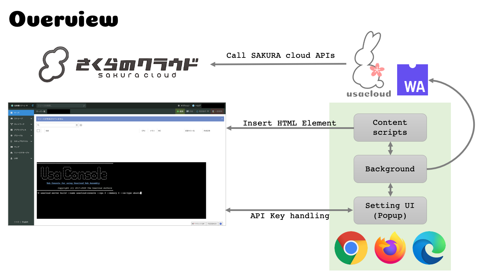
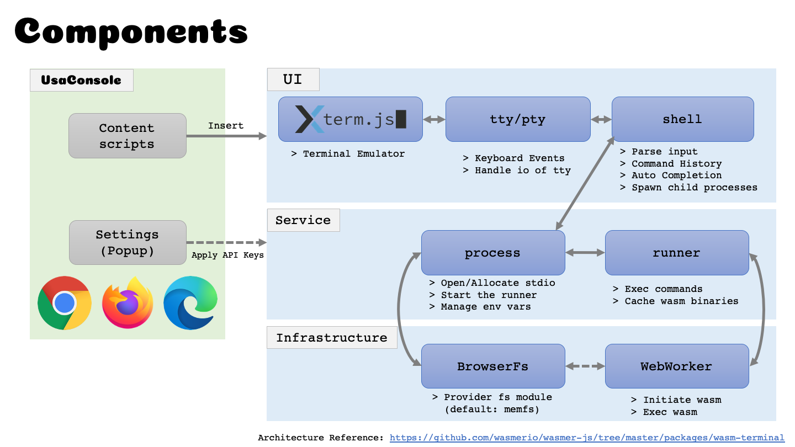

# UsaConsole

さくらのクラウドのコントロールパネル上で[Usacloud](https://github.com/sacloud/usacloud)を利用できるようにするためのブラウザ拡張を実装する。

## 背景

さくらのクラウド CLIである[Usacloud](https://github.com/sacloud/usacloud)のv1.0においてWebAssembly対応が行われる。  
これを利用しブラウザ上でUsacloudを手軽に実行できる環境を提供したい。

## Goal / Non-Goal

### Goal

- ブラウザ上で動くコンソール(ターミナル)を実装する
- コンソール上で`usacloud`コマンドを実行可能にする他、jqなどの付帯的なソフトウェアも実行可能とする
- コンソール上で対話入力やパイプなどbash等のシェルが持つ機能のサブセットを提供する
- ブラウザ上で稼働する擬似的なファイルシステムを提供する
- ブラウザ拡張をパッケージングし各種ストアやGitHubなどで配布/インストール可能にする

### Non-Goal

- 通常版のUsacloudの全機能の提供。SSHやRDP、FTPSでのファイルアップロードなどには対応しない
- 完全なシェルの提供。bash風の操作ができるコンソールを提供するが、バッククォートなどでのサブシェルの実行などには対応しない
- 網羅的なコマンドの提供。`ls`や`cat`といったコマンドは提供せず、`usacloud`コマンドの入出力操作の補助を行うようなもののみ提供する
- 永続的なファイルシステムの提供。初期実装としてはmemfsなどのインメモリストアのみサポートし、今後のバージョンで外部ストレージなどのサポートを視野に入れる
- コントロールパネルと同レベルでのブラウザサポート。現状はChrome/FireFox/Edgeのみを対象とする。

## 設計

### 概要

- ブラウザ拡張のContent Scriptsを用いてさくらのクラウドの[コントロールパネル](https://secure.sakura.ad.jp/cloud)に対しHTMLエレメントを動的に差し込む
- ブラウザ拡張のBrowser Action(Popup)を用いてAPIキーの入力画面を表示、入力されたAPIキーはContent Scripts側に引き渡す
- Content Scriptsでコンソールを表示、入力に応じてWebAssemblyとしてビルドしたUsacloudコマンドを実行する

Note: さくらのクラウド APIはコントロールパネルと同じオリジンで提供されているためwasmからのfetchも問題なく行える

### 詳細

大枠はwasmerio/wasmer-jsから提供されているwasm-terminalの設計を参考にする。  
https://github.com/wasmerio/wasmer-js/tree/master/packages/wasm-terminal

wasm-terminalを用いてWASIを実行する環境として既に[WebAssembly.sh](https://webassembly.sh)があるが、
Goは公式にはWASIに対応していないことからUsaConsoleはwasm-terminalを元に必要な改修を加えていく形で実装する。

参考: [golang/go: wasm: support new WASI interface](https://github.com/golang/go/issues/31105)

#### 各コンポーネントの詳細

- [Xterm.js](https://xtermjs.org): ブラウザ上での端末機能
- Tty/Pty: 端末からの入力/端末への出力などの各種イベントハンドリング
- Shell: コマンドラインのパースを行い、プロセスの生成〜実行を行わせる。パイプやヒストリー、入力補完、環境変数の仕組みもここで実装する
- Process: 標準入力/出力/エラーのオープンやttyの割り当てを行う。shellから受け取ったコマンドやコマンドライン引数、環境変数を保持しrunnerを起動する
- Runner: WebWorkerを用いて実際のコマンドの起動を行う。wasmはシグナルをサポートしないため、SIGINTなどを受けた際はrunnerを終了させることで対応する。
- BrowserFs: ブラウザ上でnode.jsのfsモジュールを提供する。https://github.com/jvilk/BrowserFS を想定しているが、
メンテナンスが活発ではなさそうなため https://github.com/streamich/memfs の利用も検討中
(前述のwasm-terminalではmemfsが利用されている)
- WebWorker: 実際のwasmの初期化や起動を行う。
(前述のwasm-terminalでは[comlink](https://github.com/GoogleChromeLabs/comlink)が利用されているが、UsaConsoleでの利用は未定)

## 課題/展望

- Usacloudのロゴ/アイコンとは別のロゴ/アイコンが欲しい
- スクリプトのアップロードやオンラインでの編集、ファイルの永続か対応などを今後のバージョンで行いたい
- Usacloudで提供しているサンドボックス環境 https://sandbox.usacloud.jp/ の置き換えなど他のプロジェクトでもUsaConsoleを利用したい