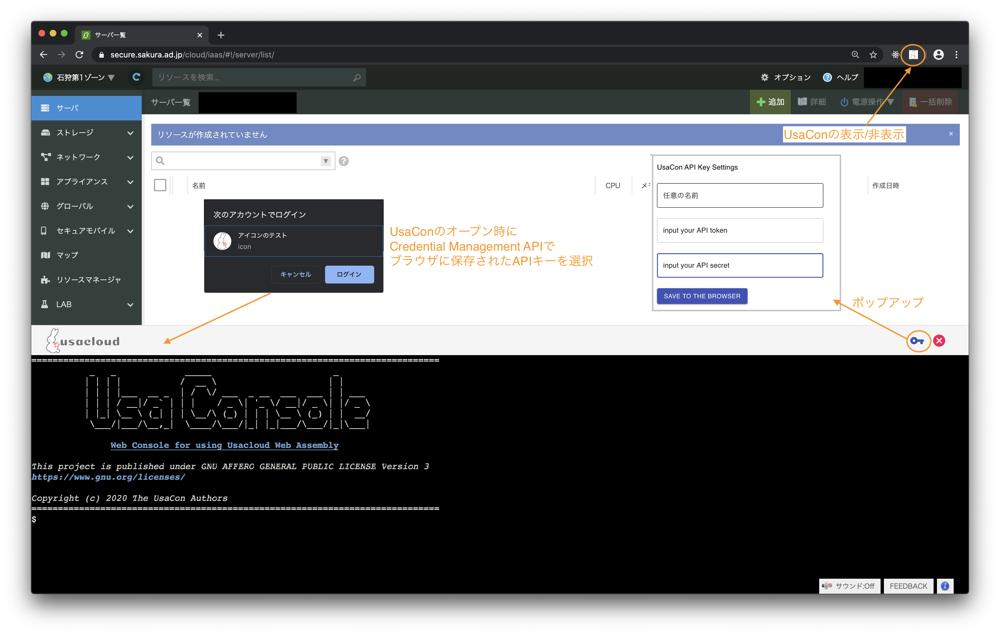

# UsaCon UIデザイン

UsaConのUIデザインの方向性について定義する。

## 設計

- ブラウザ拡張のアイコン(右上)をクリックするとUsaConの表示/非表示をトグルする
- UsaCon表示時に(毎回) Credential Management APIを用いてブラウザに保存されているAPIキーを参照する
- 鍵アイコンをクリックするとCredential Management APIでAPIキーを保存するためのポップアップが開く

## 検討

現在利用しているAPIキーの名前(PasswordCredential.name)を鍵アイコンの横辺りに表示できないか?
-> 選択しているAPIキーが必ず使われる? 別のAPIキーが使われる可能性はないか?

